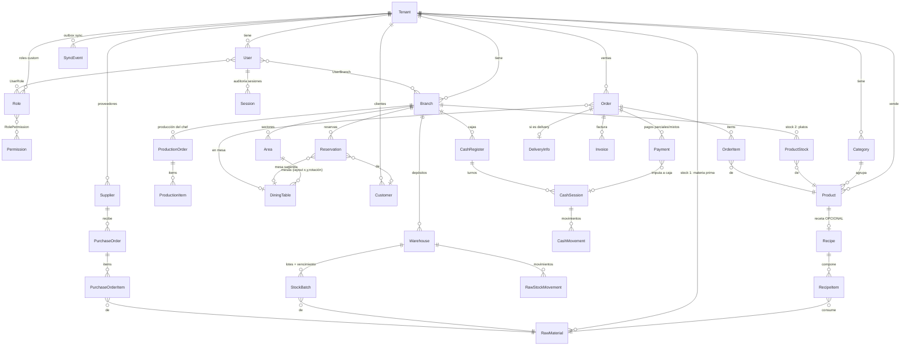

# Base de datos — ERPresto

Schema completo en [`apps/api/prisma/schema.prisma`](../apps/api/prisma/schema.prisma). PostgreSQL 16, Prisma ORM, PKs UUID (requisito offline-first), `Decimal` para todo valor monetario y de stock.

## Dominios

| Dominio | Tablas |
|---|---|
| Tenancy | `Tenant`, `Branch` |
| Identidad y RBAC | `User`, `UserBranch`, `Role`, `Permission`, `RolePermission`, `UserRole`, `Session`, `AuditLog` |
| Catálogo | `Category`, `Product`, `Recipe`, `RecipeItem` |
| Stock materia prima | `RawMaterial`, `Warehouse`, `StockBatch`, `RawStockMovement` |
| Stock producción | `ProductStock`, `ProductStockMovement`, `ProductionOrder`, `ProductionItem` |
| Salón | `Area`, `DiningTable`, `Reservation` |
| Ventas | `Order`, `OrderItem`, `Payment` |
| Caja | `CashRegister`, `CashSession`, `CashMovement` |
| Compras | `Supplier`, `PurchaseOrder`, `PurchaseOrderItem` |
| Clientes y delivery | `Customer`, `DeliveryInfo` |
| Facturación AR | `Invoice` (preparada para ARCA: CAE, punto de venta, tipos A/B/C y NC) |
| Sync offline | `SyncEvent` (outbox) |

## ERD (entidades principales)



## Decisiones de modelado

- **Doble stock sin FK entre sí.** `RawMaterial`/`StockBatch` y `ProductStock` no se referencian. El único puente es `Recipe`, que es opcional y desactivable. Esto garantiza a nivel de schema que ningún flujo pueda imponer la relación.
- **Stock como suma de movimientos.** `RawStockMovement` y `ProductStockMovement` son append-only (positivo entra, negativo sale). `ProductStock.quantity` y `StockBatch.quantity` son proyecciones materializadas para lectura rápida; ante conflictos de sync, el estado se reconstruye desde los movimientos — nunca se pierde información.
- **Lotes y vencimientos** en `StockBatch`: el disponible de un insumo en un depósito es la suma de sus lotes; permite FIFO/FEFO y alertas de vencimiento.
- **Configuración flexible en `Json settings`** sobre `Tenant` y `Branch` para preferencias que no requieren integridad referencial (módulos habilitados, impresoras, formato de ticket), más enums tipados (`StockConfigMode`, `StockLinkMode`) para lo que sí afecta lógica de negocio.
- **Mesas unidas** vía self-relation `DiningTable.mergedIntoId`; el layout del editor visual (x, y, ancho, alto, rotación, color, forma) persiste en la propia mesa.
- **`Order.number` correlativo por sucursal** (`@@unique([branchId, number])`) para comandas legibles, conviviendo con PK UUID global.
- **Campos de sync en tablas operativas**: `deviceId`, `version`, `occurredAt` (hora real del hecho, distinta de `createdAt` de inserción — clave cuando se sincroniza con retraso).

## Índices

Todos los accesos calientes están cubiertos: `tenantId` en catálogos, `(tenantId, branchId, status)` en pedidos, `(branchId, scheduledAt)` en reservas, `(warehouseId, rawMaterialId)` y `occurredAt` en movimientos, `expiresAt` en lotes, `(tenantId, status)` en el outbox de sync.

## Cómo aplicar

```bash
cd apps/api
npx prisma migrate dev   # crea/aplica migraciones
npm run prisma:seed      # catálogo de permisos, roles de sistema y tenant demo
```
